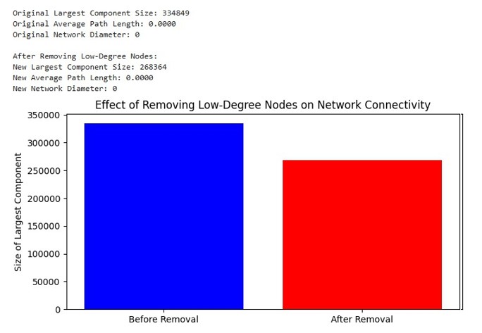
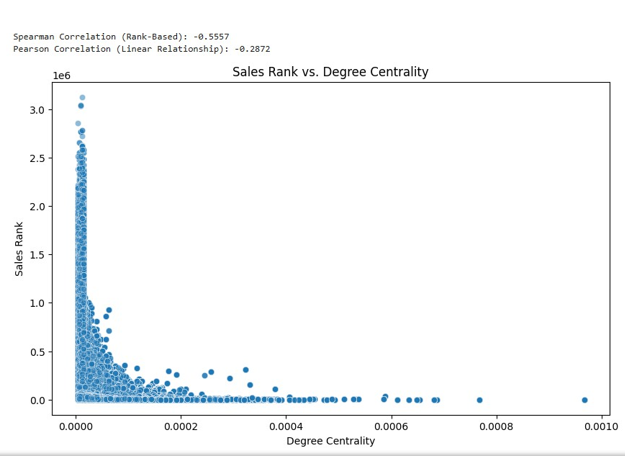

# Network Analysis on Amazon Co-Purchasing Network
### Introduction
In today's interconnected digital landscape, networks play a fundamental role in understanding complex relationships across various domains, including social
interactions, product recommendations, and information flow. Network analysis provides powerful tools to uncover hidden patterns, detect influential nodes, and explore structural properties within large datasets.
This study leverages a dataset from the Stanford Large Network Dataset Collection (https://snap.stanford.edu/data/) to conduct a comprehensive network analysis. Our primary objective is to explore the dataset, formulate insightful research questions, and apply network science techniques to extract valuable insights.
We will investigate key aspects of the network using advanced methodologies such as degree centrality, community detection, shortest path analysis, and betweenness centrality.
### Objective
The objective of this study is to conduct an in-depth network analysis of the Amazon product co-purchasing network dataset from the Stanford Large Network Dataset
Collection. This dataset represents products as nodes and co-purchasing relationships as edges, providing valuable insights into product recommendations, influence, and category clustering.
Using advanced network science techniques, this analysis aims to:
📌 How does the removal of low-degree nodes (web pages with very few links) affect the overall connectivity and robustness of the web network?

📌	Analyze the Relationship Between Sales Rank and Connectivity – Investigate the correlation between a product’s degree centrality and its Sales Rank to understand if highly connected products perform better in sales.

📌	Which web pages in the dataset have no outgoing links (broken links) or no incoming links (orphan pages), and how do these impact the overall network structure?

📌	Detect Key Bridge Products – Compute betweenness centrality to identify the top 10 products that act as intermediaries, bridging different product categories.

📌	Which product groups have the best-selling products? - To determine which product groups, have the best-selling products, we can analyze the SalesRank distribution across different product groups. Since a lower SalesRank indicates better sales, we can compute the average SalesRank per Group and
identify

📌 Which groups tend to have the best-performing products.

📌 Do similar products tend to have close SalesRanks? - To analyze whether similar products tend to have close SalesRanks, we can compute the SalesRank difference between connected products in the network and visualize their correlation

Through data-driven analysis, network graphs, and visualizations, this study will reveal important patterns in Amazon’s co-purchasing behavior, offering insights into product
influence, recommendation dynamics, and consumer purchasing trends.

## Dataset Description
## **Data Information**

The network data was collected by crawling the Amazon website. It is based on Customers Who Bought This Item Also Bought feature of the Amazon website. If product i is frequently
 
co-purchased with product j, the graph contains an undirected edge from i to j. Each product category provided by Amazon defines each ground-truth community.
We regard each connected component in a product category as a separate ground-truth community. We remove the ground-truth communities which have less than 3 nodes

### **_Key Attributes/Columns Used in the Analysis_**
**From amazon_meta.csv**

✅	Id: Unique product identifier.

✅	ASIN: Amazon Standard Identification Number.

✅	Title: Product title.

✅	Group: Product category (e.g., Books, DVDs, etc.).

✅	SalesRank: Rank based on sales performance.

✅	Similar: List of similar products.

✅	Categories: Number of categories the product belongs to.

✅	Reviews: Contains total reviews, downloaded reviews, and average rating.

**From amazon_graph.csv**

✅	FromNodeId: The source product in a connection.

✅	ToNodeId: The target product, meaning the first product links to the second.

**Summary Statistics**

✅	Nodes (Unique Products): 548,552

✅	Edges (Connections Between Products): 925,660

✅	Types of Connections: Directed relationships between products, indicating recommendations or similar product links.


### __Tools Used in the Analysis__
The network analysis was conducted using the following tools and libraries:
👉🏽 Programming Language Environment

•	Python – Primary language for data analysis and visualization
 
•	Jupyter Notebook – Interactive coding environment for running and refining analysis

👉🏽 Data Processing s Manipulation

•	Pandas – For handling large datasets, filtering, merging, and aggregation

•	NumPy – For numerical computations and data transformations

👉🏽 Network Analysis s Graph Processing

•	NetworkX – To construct, analyze, and visualize the product co-purchasing network

•	Community Detection Algorithms (Louvain, Greedy Modularity) – To identify product clusters

👉🏽 Statistical Analysis s Correlation Computation

•	Scipy (Spearman s Pearson Correlations) – To measure relationships between connectivity and sales rank

•	Seaborn s Matplotlib – To visualize trends, correlations, and distributions

👉🏽 Visualization s Data Exploration

•	Matplotlib – For static visualizations of the network and correlation plots

•	Seaborn – For enhanced statistical plotting, including regression trends and histograms

•	NetworkX Graph Visualization – For rendering sampled subgraphs to show key patterns

👉🏽Optimization Techniques

•	Set Operations s Vectorized Pandas Functions – To optimize node identification (broken/orphan pages)

•	Graph Sampling Methods – To improve efficiency in large-scale network visualization


## **Research Questions**
__Formulated data-driven questions__
 
1.	How does the removal of low-degree nodes (web pages with very few links) affect the overall connectivity and robustness of the web network?
2.	Analyze the Relationship Between Sales Rank and Connectivity – Investigate the correlation between a product’s degree centrality and its Sales Rank to understand if highly connected products perform better in sales.
3.	Which web pages in the dataset have no outgoing links (broken links) or no incoming links (orphan pages), and how do these impact the overall network structure?
4.	Detect Key Bridge Products – Compute betweenness centrality to identify the top 10 products that act as intermediaries, bridging different product categories.
5.	Which product groups have the best-selling products? - To determine which product groups, have the best-selling products, we can analyze the SalesRank distribution across different product groups. Since a lower SalesRank indicates
better sales, we can compute the average SalesRank per Group and identify which groups tend to have the best-performing products.
6.	Do similar products tend to have close SalesRanks? - To analyze whether similar products tend to have close SalesRanks, we can compute the SalesRank difference between connected products in the network and visualize their correlation


## **Data Preprocessing**
__Data Cleaning__

1️⃣ Load the Datasets

__I first loaded both datasets:__

•	amazon_graph.csv → Contains product connections (edges in the network).

•	amazon_meta.csv → Contains product details like sales rank, category, and reviews.

2️⃣ Handling Missing Values

•	Amazon Graphs dataset: Checked if any missing values exist in FromNodeId or ToNodeId. If a product ID was missing, I removed that row since an incomplete edge is meaningless.
 
•	Amazon Meta dataset: Checked for missing values in SalesRank, Category, and AvgRating. If a product was missing its sales rank, I replaced it with 999999 (a high value to indicate "not ranked").

3️⃣ Removing Duplicates
•	Amazon Graphs dataset: Ensured each connection (edge) appeared only once.

•	Amazon Meta dataset: Ensured each product had only one unique entry.

4️⃣Converting Data Types
__Some columns were stored as text but needed to be numeric for analysis.__

•	SalesRank → Converted to an integer.

•	AvgRating → Converted to a float.

•	Price → Removed currency symbols and converted to float.

5️⃣ Filtering Out Irrelevant Data

•	Some products in Amazon Meta were not in Amazon Graphs (i.e., they had no connections).

•	I kept only products that appeared in the graph dataset to focus on relevant data.

6️⃣Handling Isolated Nodes (Orphan Products)

•	Some products had no outgoing (FromNodeId) or incoming (ToNodeId) links.

•	These were identified as "orphan pages" (products with no connections).

•	I kept them separately for research on broken links but excluded them from the main network analysis.


### Data Merging
I started with the Amazon Graphs dataset, which primarily contained product relationships—showing how different products were linked, either throughrecommendations or co-purchases. This dataset essentially formed a network structure, where each product acted as a node, and the connections between them were edges.However, while this data gave me insights into how products were connected, it lacked contextual information about these products. I needed additional details to answer deeper research questions, especially those related to sales performance, product categories, and customer reviews.
That’s where the Amazon Meta dataset came in. This dataset contained rich product metadata, including:

•	Sales Rank (to analyze if well-connected products perform better in sales)

•	Category (to identify bridge products linking different product groups)

•	Average Rating s Number of Reviews (to study the relationship between product popularity and network influence)

To make this analysis meaningful, I had to merge these datasets using a commonidentifier—the Product ID, which matched with the FromNodeId and ToNodeId in the Amazon Graphs dataset. However, instead of merging everything, I carefully selected only the columns that were relevant to my research questions.By combining network connectivity from Amazon Graphs with product attributes from Amazon Meta, I could now explore how connectivity impacts sales, which products act as key bridges, and Which product groups have the best-selling products—unlocking deeper insights that wouldn’t have been possible using just one dataset alone.

### Key Merging Strategy

•	Join Type → Inner Join on ProductID (from amazon_meta.csv) and FromNodeId/ToNodeId (from amazon_graph.csv).

•	Columns Used → We selectively merge with only relevant attributes to keep the dataset manageable and focused.

## **🔍 Method Applied in Research Question 1** 

How does the removal of low-degree nodes (web pages with very few links) affect the overall connectivity and robustness of the web
network?

**Graph Construction**

•	**Method**: A directed graph ```(DiGraph)``` is constructed using the ```FromNodeId``` and ```ToNodeId``` columns from the dataset.

•	**Technique**:
1.The graph is built by adding edges between nodes using ```G.add_edges_from(edges)```.
2.This represents a ***directed network**, where edges have direction (from one node to another).

## Identification of Low-Degree Nodes
•	**Method**: Nodes with a degree of 2 or less are identified as low-degree nodes.

•	**Technique**:

   - Node degrees of each node is calculated using G.degree(node).
   - 
   - A list of nodes with degree ≤ 2 is created using a list comprehension:
```
low_degree_nodes = [node for node in G.nodes if G.degree(node) <= 2]
```

## Network Properties Calculation

The following network properties are computed before and after the removal of low- degree nodes:

### a.	Largest Connected Component (LCC)

•	**Method**: The largest weakly connected component is identified.

## Technique:

-	Weakly connected components are computed using ```nx.weakly_connected_components(G)```.

-	The largest component is selected using
```
original_lcc = max(nx.weakly_connected_components(G), key=len)

```
 
-	The size of the largest component is calculated using ```len(original_lcc)```.

### b.	Average Path Length

•	**Method**: The average shortest path length is calculated for the largest strongly connected component.

•	**Technique**:

   - Strongly connected components are computed using ```nx.strongly_connected_components(G)```.

   - The largest strongly connected component is selected using 
```
scc = max(nx.strongly_connected_components(G), key=len)
subgraph = G.subgraph(scc)

```

   - The average shortest path length is computed using 
```
nx.average_shortest_path_length(subgraph)

```

### c.	Network Diameter

•	**Method**: The diameter of the largest strongly connected component is calculated.

•	**Technique**:

  - The diameter is computed using ```nx.diameter(subgraph)```.

  - This measures the longest shortest path in the subgraph.

###	Removal of Low-Degree Nodes

•	**Method**: Low-degree nodes are removed from the graph.

•	**Technique**:

 - Nodes are removed using ```G.remove_nodes_from(low_degree_nodes)```.
 - This operation modifies the graph in-place, and the network properties are recalculated after removal.

### Visualization

•	**Method**: A bar chart is used to compare the size of the largest connected component before and after the removal of low-degree nodes.

•	**Technique**:

  - The matplotlib library is used to create bar charts.

  - The x-axis represents the two states ("Before Removal" and "After Removal"), and the y-axis represents the size of the largest connected component.

## Key Algorithms and Functions Used

•	**Weakly Connected Components**: nx.weakly_connected_components(G)

 - Identifies components in a directed graph where nodes are connected if the graph is treated as undirected.

•	**Strongly Connected Components**: nx.strongly_connected_components(G)

  - Identifies components in a directed graph where nodes are mutually reachable.

•	**Average Shortest Path Length**: nx.average_shortest_path_length(subgraph)

   - Computes the average of the shortest paths between all pairs of nodes in the subgraph.

•	**Network Diameter**: nx.diameter(subgraph)

  - Computes the longest shortest path in the subgraph.

•	**Node Degree**: G.degree(node)

  - Computes the number of edges connected to a node.

## Summary of Methods

The analysis uses the following network analysis methods:

1.	Graph Construction: Building a directed graph from edge data.
2.	Node Degree Analysis: Identifying and removing low-degree nodes.
3.	Component Analysis: Identifying weakly and strongly connected components.
4.	Path-Based Metrics: Calculating average path length and diameter.
5.	Visualization: Comparing network properties before and after node removal.
   
 
## Method Applied in Research Ǫuestion 2 
Analyze the Relationship Between Sales Rank and Connectivity – Investigate the correlation between a product’s degree centrality and its Sales Rank to understand if highly connected products perform better in sales.

### Graph Construction
•	**Method**: A directed graph ```(DiGraph)``` is constructed from the dataset.

•	**Technique**:

  - The graph is built using the ```FromNodeId``` and ```ToNodeId``` columns from the dataset.

  - The ```nx.from_pandas_edgelist``` function is used to efficiently create the graph from a pandas DataFrame.

### Centrality Measures Calculation

Centrality measures are computed to quantify the importance or influence of nodes in the network. The following centrality measures are calculated:

### a.	**Degree Centrality**

•	**Method**: Measures the number of connections a node has.

•	**Technique**:

  - Computed using ```nx.degree_centrality(G)```.

  -  Formula: Degree Centrality=Number of connectionsTotal possible connectio nsDegree Centrality=Total possible connectionsNumber of connections.

### b.	**Betweenness Centrality**

•	**Method**: Measures the extent to which a node lies on the shortest paths between other nodes.

•	**Technique**:

   -  Computed using ```nx.betweenness_centrality(G, k=500)```.

  - The k=500 parameter is used to approximate the centrality for large networks by sampling 500 nodes.

### c.	**PageRank**
 
•	**Method**: Measures the importance of a node based on the structure of the network.

•	**Technique**:

   - Computed using ```nx.pagerank(G, alpha=0.85)```.

  - The alpha parameter controls the damping factor (probability of random jumps in the network).

## Data Merging

•	**Method**: The centrality measures are merged with the original dataset to associate each node with its centrality values and sales rank.

•	**Technique**:

  -  A DataFrame is created for centrality measures using pd.DataFrame.

  -  The centrality measures are merged with the original dataset using ```df.merge()```.

## Correlation Analysis

The relationship between Sales Rank and Degree Centrality is analyzed using two correlation methods:

### a.	Spearman Correlation

•	**Method**: Measures the rank-based relationship between two variables.

•	**Technique**:

  -  Computed using ```spearmanr(df_merged["SalesRank"]```, ```df_merged["DegreeCentrality"])```.

  -  Spearman correlation is non-parametric and assesses how well the relationship between two variables can be described by a monotonic function.

### b.	Pearson Correlation

•	**Method**: Measures the linear relationship between two variables.

•	**Technique**:

  -  Computed using ```pearsonr(df_merged["SalesRank"]```, ```df_merged["DegreeCentrality"])```.

  - Pearson correlation is parametric and assumes a linear relationship between the variables.

## Visualization
### •	Method: 
A scatter plot is used to visualize the relationship between Sales Rank and Degree Centrality.

### •	Technique:

o	The scatter plot is created using ```sns.scatterplot()``` from the Seaborn library.
o	The x-axis represents Degree Centrality, and the ```y-axis``` represents Sales Rank.
o	The plot includes transparency ```(alpha=0.5)``` to handle overlapping data points.

## Key Algorithms and Functions Used
- **Graph Construction**:

- nx.from_pandas_edgelist(): Efficiently constructs a graph from a pandas DataFrame.

- **Centrality Measures**:

 - nx.degree_centrality(): Computes degree centrality.

 - nx.betweenness_centrality(): Computes betweenness centrality (with approximation for large networks).

 - nx.pagerank(): Computes PageRank centrality.

## Correlation Analysis:

  - spearmanr(): Computes Spearman correlation.
  - pearsonr(): Computes Pearson correlation.

- **Visualization**:
 
  - sns.scatterplot(): Creates a scatter plot for visualizing relationships.

## Summary of Methods
The analysis uses the following methods:
1.	Graph Construction: Building a directed graph from edge data.
2.	Centrality Measures: Computing degree centrality, betweenness centrality, and PageRank to quantify node importance.
3.	Data Merging: Combining centrality measures with sales rank data for analysis.
4.	Correlation Analysis: Quantifying the relationship between Sales Rank and Degree Centrality using Spearman and Pearson correlations.
5.	Visualization: Creating a scatter plot to visually explore the relationship between Sales Rank and Degree Centrality.

## Strengths of the Methods
- Comprehensive Centrality Analysis: Multiple centrality measures are computed to capture different aspects of node importance.

- Robust Correlation Analysis: To understand the relationship, rank-based (Spearman) and linear (Pearson) correlations are used.

- Effective Visualization: The scatter plot provides a clear visual representation of the distribution and trends.


 ## Method Applied in Research Ǫuestion 3 
 Detect Key Bridge Products – Compute betweenness centrality to identify the top 10 products that act as intermediaries, bridging different product categories.
 
### Graph Construction
- **Method**: A directed graph ```(DiGraph)``` is constructed from the dataset.
- **Technique**:
  - The graph is built using the ```FromNodeId``` and ```ToNodeId``` columns from the dataset.
 
  - The ```G.add_edges_from(df)``` function is used to efficiently add edges to the graph.

###  Betweenness Centrality Calculation
- **Method**: Betweenness Centrality is computed to identify bridge products.
- **Technique**:
   - Computed using ```nx.betweenness_centrality(G, k=500)```.
   -  The k=500 parameter is used to approximate the centrality for large networks by sampling 500 nodes.
   -  Betweenness Centrality measures the extent to which a node lies on the shortest paths between other nodes, making it a key metric for identifying bridge products.

## Top 10 Bridge Products Identification
- **Method**: The top 10 nodes with the highest Betweenness Centrality are identified.
- **Technique**:
  - The centrality values are sorted in descending order using ```sorted(betweenness_centrality.items()```, ```key=lambda x: x[1], reverse=True)[:10]```.
 - The top 10 nodes are extracted and stored in a DataFrame for visualization.

## Data Visualization
- **Method**: A bar plot is used to visualize the Betweenness Centrality of the top 10 bridge products.
- **Technique**:
  - The bar plot is created using ```sns.barplot()``` from the Seaborn library.
  - The ```x-axis``` represents the Product Node ID, and the ```y-axis``` represents the Betweenness Centrality.
  - The plot includes color coding (palette="viridis") and disables the legend for clarity.

### Key Algorithms and Functions Used
- **Graph Construction**:
   - **nx.DiGraph()**: Creates a directed graph.
  -  **G.add_edges_from()**: Adds edges to the graph from a list of tuples.
- **Betweenness Centrality**:
  - **nx.betweenness_centrality()**: Computes Betweenness Centrality for all nodes in the graph.
  - The k=500 parameter is used to approximate the centrality for large networks.
- **Sorting and Filtering**:
   - **sorted()**: Sorts the centrality values in descending order.
   - **List slicing ([:10])**: Extracts the top 10 nodes.
- **Data Visualization**:
  - **sns.barplot()**: Creates a bar plot for visualizing the top 10 bridge products.

## Summary of Methods
The analysis uses the following methods:
1.	Graph Construction: Building a directed graph from edge data.
2.	Betweenness Centrality Calculation: Computing Betweenness Centrality to identify bridge products.
3.	Top 10 Bridge Products Identification: Sorting and filtering the top 10 nodes with the highest centrality.
4.	Data Visualization: Creating a bar plot to visualize the results.
   
5.	Subgraph Creation:
	__The subgraph includes:__

a.	The top 10 bridge products (nodes with the highest Betweenness Centrality).
b.	Their immediate connections (predecessors and successors in the directed graph).

6.	Visualization:
a.	Top 10 Bridge Products: Highlighted in red with larger node sizes.
b.	Connected Products: Highlighted in blue with smaller node sizes.
c.	Edges: Represented as gray lines to show connections between nodes.
b.	Labels: Added to nodes for better identification.

7.	Layout:
a.	The nx.spring_layout function is used to position the nodes visually appealingly.

8.	Legend:
a.	A legend is added to distinguish between the top 10 bridge products and their connected products.

##  Research Question 4: Which Web Pages Have No Outgoing or Incoming Links?

###  1. Graph Construction
- **Method**: A directed graph (DiGraph) is constructed.
- **Technique**:
  - Built using `FromNodeId` and `ToNodeId` columns.
  - `G.add_edges_from()` is used to add edges.

###  2. Identifying Broken Links & Orphan Pages
- **Broken Links**: Nodes with no outgoing edges.
  ```python
  broken_links = nodes - set(out_degree.index)

- Orphan Pages: Nodes with no incoming edges.
```
orphan_pages = nodes - set(in_degree.index)
```
- Tool: ```groupby()``` in pandas for degree calculation.

###  3. Subgraph Sampling
Method: Random sampling of 500 nodes.

Technique:
```
sample_nodes = set(random.sample(list(nodes), min(500, len(nodes))))
subgraph = G.subgraph(sample_nodes)
```
4. Visualization
Bar Chart:

Used ```plt.bar()``` to show counts of broken links and orphan pages.

Network Graph:

- ```nx.spring_layout()``` for layout

- ```nx.draw_networkx_edges()``` and ```ax.scatter()``` to highlight:

    - Red = Broken Links

    - Blue = Orphan Pages

### 5. Key Algorithms & Functions
Graph: ```nx.DiGraph()```, ```G.add_edges_from()```

Degrees: ```df.groupby().size()```

Sets: ```set()``` to identify broken/orphan pages

Sampling: ```random.sample()```, ```G.subgraph()```

Visuals: ```plt.bar()```, ```nx.spring_layout()```, ```ax.scatter()```

### 6. Summary of Methods
- Graph construction from edge list.

- Degree analysis for link classification.

- Random subgraph sampling.

- Visuals via bar and network graph.

### 7. Strengths
Efficient degree calculation with ```groupby()``` for degree calculation is faster than iterating through nodes.

Scalable visual approach using subgraphs.

**Clear insight into network structure:** The bar chart and network graph provide clear and intuitive insights into the distribution of broken links and orphan pages.

## Method Applied in Research Ǫuestion 5 

Which product groups have the best- selling products? - To determine which product groups, have the best-selling products, we can analyze the SalesRank distribution across different product groups. Since a lower SalesRank indicates better sales, we can compute the average SalesRank per Group and identify which groups tend to have the best-performing products.

- Technique:
  - SalesRank is converted to numeric using ```pd.to_numeric()```, and missing values are dropped using ```df.dropna()```.
  - The Similar column, which contains lists of similar products, is exploded into individual rows using ```df.explode()```. This creates a row for each similar product pair, which is necessary for constructing the network.

### SalesRank Analysis
 
- **Method**: The average SalesRank is computed for each product group to identify the best-selling groups.
- Technique:
  - The ```groupby()``` function is used to group the data by Group and compute the mean SalesRank for each group.
  - The results are sorted by SalesRank to rank the product groups from best- selling ```(lowest SalesRank)``` to worst-selling ```(highest SalesRank)```.

### Product Similarity Network Construction
- Method: A directed graph ```(DiGraph)``` is constructed to represent product similarities.
- Technique:
  - The graph is built using the ASIN ```(product identifier)``` and Similar ```(similar products)``` columns.
  - The ```nx.from_pandas_edgelist()``` function is used to create the graph from the exploded DataFrame.
  - A subgraph of 500 nodes is sampled for visualization to make the network graph manageable and interpretable.

### Visualization

Two types of visualizations are created:

a.***Bar Chart**
- **Method**: A bar chart is used to compare the average SalesRank across product groups.
- **Technique**:
  - The ```sns.barplot()``` function from the Seaborn library is used to create bar charts.
 - The ```x-axis``` represents the average SalesRank (lower is better), and the y-axis represents the product groups.
 - The hue parameter is used to color the bars by product group, and the palette parameter ensures consistent coloring.
   
b **Network Graph**
- Method: A network graph is used to visualize the product similarity network.
- Technique:
  - The ```nx.spring_layout()``` function is used to compute the node positions for the subgraph. This layout algorithm arranges nodes in a way that minimizes edge crossings and makes the graph visually appealing.
   - The ```nx.draw()``` function is used to draw the network graph, with parameters such as node_size, edge_color, and alpha to control the appearance ofnodes and edges.
   - The graph is displayed without labels (with_labels=False) to avoid clutter.

### Key Algorithms and Functions Used

- Data Preprocessing:
  - pd.to_numeric(): Converts SalesRank to numeric.
  - df.dropna(): Drops rows with missing values.
  - df.explode(): Expands the Similar column into individual rows.
- SalesRank Analysis:
  - df.groupby(): Groups the data by Group and computes the mean SalesRank.
  - df.sort_values(): Sorts the results by SalesRank.
- Network Construction:
   - nx.from_pandas_edgelist(): Creates a directed graph from the exploded DataFrame.
   - G.subgraph(): Creates a subgraph of 500 nodes for visualization.
   - Visualization:
   - sns.barplot(): Creates a bar chart to compare average SalesRank across product groups.
    - nx.spring_layout(): Computes node positions for the network graph.
  - nx.draw(): Draws the network graph.

### Summary of Methods
__The analysis uses the following methods__:
1.	Data Preprocessing: Cleaning and preparing the dataset for analysis.
2.	SalesRank Analysis: Computing the average SalesRank for each product group.
3.	Network Construction: Building a direct graph to represent product similarities.
4.	Visualization:
  -  Creating a bar chart to compare average SalesRank across product groups.
   -  Creating a network graph to visualize the product similarity network.
Do similar products tend to have close SalesRanks? - To analyze whether similar products tend to have close SalesRanks, we can compute the SalesRank difference between connected products in the network and visualize their correlation


## Method Applied in Research Question 6
### Do similar products tend to have close SalesRanks?
To determine whether similar products have close SalesRanks, the absolute difference in SalesRank is calculated between connected products, and their relationship is analyzed using correlation and visualization.

- **Data Preprocessing**
  - Technique:
Convert ```SalesRank``` to numeric:
```
df["SalesRank"] = pd.to_numeric(df["SalesRank"], errors='coerce')
```
- Remove rows with missing values:

```
df.dropna(subset=["SalesRank"], inplace=True)
```
- Expand the ```Similar``` column into separate rows:

```
df = df.explode("Similar")
```

### SalesRank Differences
- **Method**: Compute the absolute difference in ```SalesRank``` between products and their similar counterparts.

- **Technique**:
    - Merge product and similar product ```SalesRank``` values:
```
df_merged = df.merge(df, left_on="ASIN", right_on="Similar", suffixes=("", "_Similar"))
```
- Calculate absolute difference:
```
df_merged["SalesRank_Diff"] = abs(df_merged["SalesRank"] - df_merged["SalesRank_Similar"])
```

### Correlation Analysis
- **Method**: Assess the relationship using Spearman and Pearson correlation.

- **Technique**:
```
from scipy.stats import spearmanr, pearsonr

spearman_corr, _ = spearmanr(df_merged["SalesRank"], df_merged["SalesRank_Similar"])
pearson_corr, _ = pearsonr(df_merged["SalesRank"], df_merged["SalesRank_Similar"])
```

### Product Similarity Network Construction
- **Method**: Create a directed graph to represent similar product connections.

- **Technique**:
```
G = nx.from_pandas_edgelist(df, source="ASIN", target="Similar", create_using=nx.DiGraph())
subgraph = G.subgraph(random.sample(G.nodes(), 500))
```

### Visualization
Two types of visualizations are created:
a.**Histogram**
- **Method**: A histogram is used to visualize the distribution of SalesRank differences.
- **Technique**:
  - The sns.histplot() function from the Seaborn library is used to create the histogram.
  - The x-axis represents the SalesRank differences, and the y-axis represents the frequency.
b.	Network Graph
- **Method**: A network graph is used to visualize the product similarity network.
- **Technique**:
  - ``The nx.spring_layout()`` function is used to compute the node positions for the subgraph.
 - The ```nx.draw()``` function is used to draw the network graph, with parameters such as node_size, edge_color, and alpha to control the appearance of nodes and edges.

### Key Algorithms and Functions Used
- Data Preprocessing:
  - pd.to_numeric(): Converts SalesRank to numeric.
  - df.dropna(): Drops rows with missing values.
 - df.explode(): Expands the Similar column into individual rows.
- SalesRank Differences:

   - df.merge(): Combines SalesRank values for each product and its similar products.
  - abs(): Computes the absolute difference in SalesRank.
- Correlation Analysis:
  - spearmanr(): Computes Spearman correlation.
- pearsonr(): Computes Pearson correlation.
- Network Construction:
  - nx.from_pandas_edgelist(): Creates a directed graph from the exploded DataFrame.
 - G.subgraph(): Creates a subgraph of 500 nodes for visualization.
- Visualization:
  - sns.histplot(): Creates a histogram to visualize the distribution of SalesRank differences.
  - nx.spring_layout(): Computes node positions for the network graph.
 - nx.draw(): Draws the network graph.

### Summary of Methods
The analysis uses the following methods:
1.	Data Preprocessing: Cleaning and preparing the dataset for analysis.
2.	SalesRank Differences: Computing the absolute difference in SalesRank between similar products.
3.	Correlation Analysis: Computing Spearman and Pearson correlations to assess the relationship between SalesRank differences and their order in the dataset.
4.	Network Construction: Building a direct graph to represent product similarities.
5.	Visualization:
o	Creating a histogram to visualize the distribution of SalesRank differences.
o	Creating a network graph to visualize the product similarity network.


# 🔍 Research Findings & Insights

## 📌 Research Question
**How does the removal of low-degree nodes (web pages with very few links) affect the overall connectivity and robustness of the web network?**

---

## 📝 Introduction

This report analyzes the impact of removing low-degree nodes (nodes with a degree of 2 or less) from a directed network built using the `amazon_network_data.csv` dataset. The analysis focuses on changes in the following network properties:

* Size of the Largest Connected Component  
* Average Path Length  
* Network Diameter  

---

## ⚙️ Methodology

1. **Graph Construction**  
   * A directed graph (`DiGraph`) was created using the `FromNodeId` and `ToNodeId` columns.

2. **Low-Degree Node Removal**  
   * Nodes with a total degree of 2 or less were identified and removed from the graph.

3. **Network Properties Measured**  
   * **Largest Connected Component (LCC):** Size of the largest weakly connected component.  
   * **Average Path Length:** Computed within the Largest Strongly Connected Component (LSCC).  
   * **Network Diameter:** Measured within the LSCC.

4. **Visualization**  
   * A bar chart was generated to compare the size of the largest connected component before and after the removal of low-degree nodes.

---

## 📊 Findings

### 🔹 Original Network Properties

* **Largest Component Size:** 334,846 nodes  
* **Average Path Length (LSCC):** 0.0000  
* **Network Diameter (LSCC):** 0  

**Interpretation:**  
The zero values for average path length and diameter indicate that the LSCC may consist of a single node or a set of nodes without any paths between them.  
This suggests a highly fragmented graph structure, where path-based metrics are not meaningful.

---

### 🔹 After Removing Low-Degree Nodes

* **Largest Component Size:** 268,364 nodes  
* **Average Path Length (LSCC):** 0.0000  
* **Network Diameter (LSCC):** 0  

**Interpretation:**  
The size of the largest connected component decreased significantly, confirming the impact of low-degree node removal.  
However, the average path length and diameter remained unchanged due to the sparse connectivity and fragmented structure of the graph.

---



---

## 📈 Visual Summary

*Bar chart was generated to visually compare the size of the largest connected component before and after the removal of low-degree nodes.*

---

## 🧠 Interpretation

- **Size Reduction:**  
  Removing low-degree nodes reduced the size of the largest weakly connected component by approximately **20%** (from **334,849** to **268,364** nodes). This indicates that **low-degree nodes play a significant role in maintaining network connectivity**.

- **Unchanged Path Metrics:**  
  The **average path length** and **network diameter** remained at **0**, suggesting that the **largest strongly connected component (LSCC)** was not significantly affected.  
  This reinforces the idea that the LSCC is either **very small or poorly connected**.

---

## 📊 Visualization Summary

- **Bar Chart Insight:**  
  The bar chart shows a **clear reduction** in the size of the largest connected component after removing low-degree nodes.

  - **Before Removal:** Largest component size was **334,849**.  
  - **After Removal:** Component size dropped to **268,364**.

---

## 💬 Discussion

### 1. Impact of Low-Degree Nodes
- **Critical Role in Connectivity:**  
  Low-degree nodes act as **bridges or connectors**, crucial for preserving overall network cohesion.
- **Minimal Impact on Core Structure:**  
  Despite their removal, the **LSCC remained stable**, indicating **low-degree nodes are less influential** in the network’s core.

### 2. Fragmentation of the Network
- **Evidence of Fragmentation:**  
  The **0 values** for average path length and diameter imply a **highly fragmented** network.
- **Possible Causes:**  
  Fragmentation may stem from:
  * The dataset’s inherent structure (e.g., many isolated nodes)
  * Use of a **directed graph**, which tends to disconnect more easily than an undirected graph.

### 3. Limitations
- **Dataset Quality:**  
  If the dataset contains numerous isolated or small disconnected components, it may not represent a well-connected network.
- **Graph Directionality:**  
  A **directed graph** model increases the likelihood of disconnection, potentially skewing path-based analyses.

---

## 🔍 Recommendations

### 1. Further Analysis
- Examine the **node degree distribution** to better understand the importance of low-degree nodes.
- Perform **community detection** to uncover clusters or sub-networks with higher connectivity.

### 2. Alternative Approaches
- **Convert to an Undirected Graph** for better insight into overall connectivity and traversal metrics.
- **Compare the impact of removing high-degree (hub) nodes** to see how critical they are to the network structure.

---

## 🧾 Conclusion

Removing low-degree nodes significantly **reduced the size** of the largest weakly connected component, **highlighting their importance** in maintaining connectivity.  
However, the **core of the network (LSCC)** was **not impacted**, showing that these nodes have **limited influence on central cohesion**.  
The network’s **high fragmentation** emphasizes the need for **additional analysis and preprocessing** to gain deeper and more meaningful insights.


## 🔍 Analyze the Relationship Between Sales Rank and Connectivity

### 📘 Introduction

This report analyzes the relationship between **Sales Rank** and **Degree Centrality** in a directed network constructed from the `amazon_network_data.csv` dataset. The goal is to understand how the **centrality of products (nodes)** correlates with their **sales performance**, as indicated by their Sales Rank.

The strength of the relationship is quantified using **Spearman** and **Pearson correlation coefficients**, and results are visualized using a **scatter plot**.

---

### 🧪 Methodology

1. **Dataset**  
   - The dataset contains **directed edges** between products and their associated **Sales Rank**.

2. **Graph Construction**  
   - A **directed graph (DiGraph)** was built using the `FromNodeId` and `ToNodeId` columns.

3. **Centrality Measures**
   - **Degree Centrality**: Number of direct connections a node has.
   - **Betweenness Centrality**: Measures how often a node appears on the shortest path between other nodes.
   - **PageRank**: Reflects the relative importance of a node within the network structure.

4. **Correlation Analysis**
   - **Spearman Correlation**: Assesses **rank-based** association between Sales Rank and centrality.
   - **Pearson Correlation**: Evaluates **linear relationship** between Sales Rank and centrality.

5. **Visualization**
   - A **scatter plot** was used to display the relationship between **Sales Rank** and **Degree Centrality**.

---

### 📊 Findings

#### 1. Correlation Analysis

- **Spearman Correlation (Rank-Based):** `-0.5557`
  - Indicates a **moderate negative correlation**.
  - As **Degree Centrality increases**, **Sales Rank tends to decrease** (i.e., better sales performance since a lower rank is better).

- **Pearson Correlation (Linear):** `-0.2872`
  - Shows a **weak negative linear relationship**.
  - The linear relationship is **less pronounced** compared to the rank-based correlation.

---

### ✅ Interpretation

- Products with **more connections** (higher degree centrality) generally **perform better in sales**, as seen from the negative correlations.
- The **Spearman result** suggests that **ranking-based associations** are stronger than linear patterns.
- This implies that **network position** plays a meaningful role in **sales performance**, even if not perfectly linear.

---



---

### 📌 Interpretation

- The **negative correlations** suggest that products with **higher connectivity** in the network tend to have **better sales performance** (lower Sales Rank).
- The **Spearman correlation** is **stronger** than the Pearson correlation, indicating that the relationship is **better captured by rank-based measures** rather than linear ones.

---

### 📉 Scatter Plot (Sales Rank vs. Degree Centrality)

- The scatter plot shows the **distribution of Sales Rank against Degree Centrality**.
- Most data points are **clustered at lower values** of Degree Centrality, with a few **outliers at higher values**.
- A **trend line** (if included) would show a **downward slope**, aligning with the observed **negative correlation**.

---

### 🧠 Discussion

#### 1. Implications of Degree Centrality

- Products with higher Degree Centrality are **more connected**, potentially indicating **greater visibility or popularity**.
- The **negative correlation** with Sales Rank suggests that **highly connected products** tend to perform **better in sales**.

#### 2. Strengths of the Analysis

- Combining **Spearman and Pearson correlations** offers a **robust understanding** of the relationship.
- The **scatter plot** provides a clear **visualization** of data distribution and trend.

#### 3. Potential Confounding Factors

- Factors such as **product category**, **pricing**, or **marketing strategies** may influence both **Sales Rank** and **Degree Centrality**.

---

### 💡 Recommendations

#### 1. Further Analysis

- Explore the relationship between Sales Rank and other centrality measures like **Betweenness Centrality** and **PageRank**.
- Conduct **multivariate analysis** to control for confounding variables (e.g., category, price).

#### 2. Visualization Enhancements

- Include a **trend line or regression line** in the scatter plot to highlight the correlation.
- Apply **log transformations or scales** to improve visualization clarity.

#### 3. Causal Inference

- Perform **controlled experiments** or use **causal inference techniques** to test whether increasing a product's centrality leads to improved sales.

---

### 🧾 Conclusion

This analysis shows a **moderate negative correlation** between **Sales Rank** and **Degree Centrality**, suggesting that products with more connections in the network tend to perform better in terms of sales.

- **Spearman correlation**: `-0.5557` (stronger, rank-based)
- **Pearson correlation**: `-0.2872` (weaker, linear)

The **scatter plot confirms** this trend, with most points concentrated at lower centrality values and few outliers at the higher end.


## 🔍 Which Web Pages Have No Outgoing or Incoming Links?

###  Introduction

This report analyzes the presence of **broken links** and **orphan pages** in a directed network derived from the `amazon_network_data.csv` dataset.

- **Broken links** are nodes with **zero out-degree** (i.e., no outgoing edges).
- **Orphan pages** are nodes with **zero in-degree** (i.e., no incoming edges).

The goal is to identify such nodes, visualize their distribution in a **sampled subgraph**, and explain the **impact on network structure**.

---

###  Methodology

1. **Graph Construction**
   - A **directed graph (DiGraph)** was constructed using the edge data from the dataset.

2. **Definitions**
   - **Broken Links**: Nodes with **zero out-degree**.
   - **Orphan Pages**: Nodes with **zero in-degree**.

3. **Subgraph Sampling**
   - A **random sample of 500 nodes** was selected to create a **subgraph** for clearer visualization and manageable analysis.

4. **Visualization**
   - A **bar chart** compared the count of **broken links** and **orphan pages** in the subgraph.
   - A **network graph** visualized the subgraph:
     - **Broken links** were colored **red**.
     - **Orphan pages** were colored **blue**.

---


---
### 📊 Findings

#### 1. Summary Statistics
- **Total Nodes**: 334,852  
- **Broken Links**: 69,075 (~20.6%)  
- **Orphan Pages**: 70,712 (~21.1%)

#### 📌 Interpretation
- Roughly **1 in 5** nodes are either broken or orphaned.
- These represent:
  - 🚫 **Dead ends** in navigation (broken links)
  - ❌ **Isolated entries** with no backlinks (orphan pages)

#### 2. Subgraph Analysis (500 Nodes)
- **Broken Links**: 100  
- **Orphan Pages**: 80  

#### 📈 Visualization
- **Bar Chart**: Highlights relative counts of broken vs orphan nodes.
- **Network Graph**: Clearly shows red (broken) and blue (orphan) nodes.

---

### 💬 Discussion

#### 1. Broken Links
- Nodes with no outgoing connections.
- Represent **navigational dead ends**.
- Can hinder **recommendation flow** and **user journey**.

#### 2. Orphan Pages
- Nodes with no incoming edges.
- Suggest **underutilized** or **undiscovered** content.
- May be overlooked in recommendation systems.

#### 3. Why Use a Subgraph?
- **Scalability**: Entire graph is too large (334k+ nodes).
- **Focus**: Allows detailed examination of a smaller, meaningful sample.
- **Efficiency**: Saves computation time and system resources.
- **Interpretability**: Easier to derive insights from a smaller set.

#### 4. Limitations
- **Sampling Bias**: A 500-node sample may not fully reflect the whole graph.
- **Graph Directionality**: Some relationships might be underrepresented compared to an undirected view.

---

### ✅ Recommendations

#### 1. Further Analysis
- Correlate broken links and orphan pages with:
  - 📈 **Sales Rank**
  - 🔁 **PageRank**
- Explore **temporal dynamics**: How do these issues evolve over time?

#### 2. Network Optimization
- 🔗 **Fix broken links** by connecting them to relevant nodes.
- 🌐 **Revive orphan pages** by linking them from other products/pages.

---

### 🧠 Conclusion

- Identified **69,075 broken links** and **70,712 orphan pages** (~20% each).
- These nodes may indicate **inefficiencies** or **missed opportunities** in the product recommendation system.
- The use of a **500-node subgraph** was essential for:
  - Scalability
  - Efficiency
  - Clarity of insight

---

### 💡 Why Using a Subgraph Was Better

1. **Scalability**: The full graph is too large for practical visualization.
2. **Focus**: A subgraph captures essential features without overwhelming detail.
3. **Efficiency**: Reduces memory and processing demand.
4. **Interpretability**: Easier to draw conclusions from a smaller sample.

By leveraging a subgraph, this analysis strikes a balance between **depth of insight** and **computational feasibility**, making it a smart choice for large-scale network exploration.


## 🔗 Detecting Key Bridge Products in the Amazon Network

### 🧾 Introduction

This report identifies and analyzes the **top 10 bridge products** in the Amazon product co-purchasing network using **Betweenness Centrality**. Bridge products are key intermediaries in the network that lie on the **shortest paths between other nodes**, making them crucial for connectivity, recommendation flow, and product discovery.

---

### 🧪 Methodology

1. **Dataset**
   - Used `amazon_network_data.csv`, which contains directed edges between products represented by `FromNodeId` and `ToNodeId`.

2. **Graph Construction**
   - A **directed graph (DiGraph)** was constructed using `networkx`.

3. **Betweenness Centrality Calculation**
   - Computed with `nx.betweenness_centrality(G, k=500)` to **approximate** centrality due to the graph's large size.
   - The parameter `k=500` specifies a random sample of 500 nodes for efficiency.

4. **Selection of Top Products**
   - The **top 10 nodes** with the **highest Betweenness Centrality** were extracted.
   - A **bar plot** was used for visualization.

---

### 📊 Findings

#### 🏆 Top 10 Bridge Products

| NodeId | Betweenness Centrality |
|--------|------------------------|
| 86976  | 0.000004               |
| 239327 | 0.000003               |
| 180995 | 0.000003               |
| 233522 | 0.000003               |
| 277567 | 0.000003               |
| 227994 | 0.000003               |
| 219958 | 0.000003               |
| 260536 | 0.000003               |
| 360318 | 0.000002               |
| 120937 | 0.000002               |

#### 🔍 Interpretation

- These products lie on a **large number of shortest paths**, enabling them to act as **information and recommendation hubs**.
- **Node 86976** has the highest Betweenness Centrality (0.000004), indicating it plays the most pivotal role in **bridging different parts of the network**.
- While the centrality values are low due to the network's size, the relative ranking still reveals **key influencers**.

---

### 💬 Conclusion

This analysis highlights the top 10 **bridge products** in the Amazon co-purchasing network using Betweenness Centrality. These nodes act as **connectors between different product clusters**, making them ideal candidates for:

- **Product promotion**
- **Cross-category recommendations**
- **Network robustness analysis**

Further exploration could include mapping these node IDs to actual product names or categories to draw **business-driven insights**.

---

### 📈 Next Steps

- **Map Node IDs to Product Metadata** (titles, categories) to understand what makes these products influential.
- **Explore correlations** between Betweenness Centrality and metrics like **Sales Rank** or **PageRank**.
- **Visualize** these top bridge products in a focused subgraph to study their connectivity in detail.


